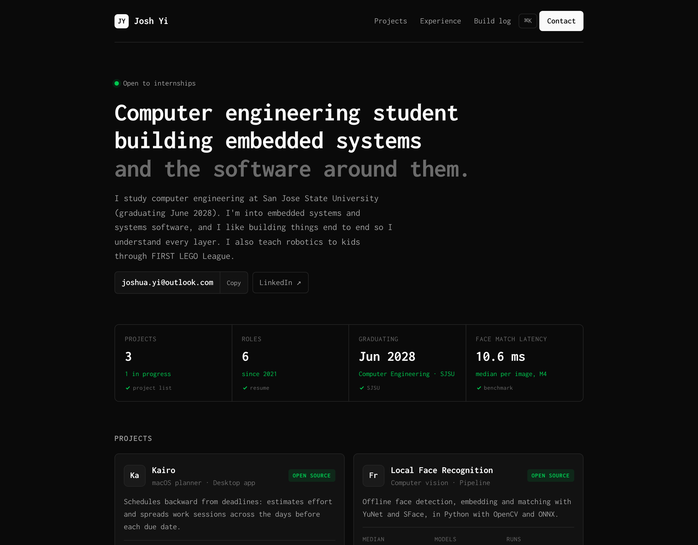
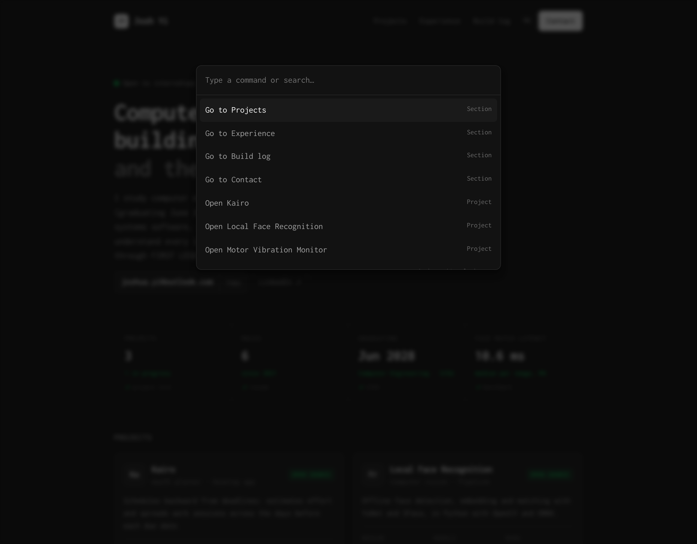

# Joshua Yi — Portfolio

My personal site: projects, experience and a running build log.



## Design

The look borrows from game HUDs and mission-control screens. The page sits on a near-black background, with monospace type throughout and a single terminal-green accent that I only use for live status and numbers moving in the right direction. Each section works like a readout panel: a stats strip at the top, project cards with three key specs each, and a dated log of what I've been building.

There are two keyboard shortcuts:

- **⌘K / Ctrl+K** opens a command palette for jumping between sections, copying my email or switching themes.
- **~** opens a small in-page console with `whoami`, `projects`, `resume` and `contact` commands.



The site follows the system light/dark setting and remembers a manual choice.

## Code

Next.js (App Router) with TypeScript, exported as a fully static site. There's no CSS framework; the styles are one stylesheet built on CSS custom properties, so both themes come from the same set of tokens.

```
app/          page layout and global styles
components/   heatmap, sparkline, command palette + console, contact links
content/      everything personal (edit these to update the site)
lib/data.ts   turns the build log into streaks, heatmap cells and relative dates
```

The content is separate from the code. `content/site.ts` holds my profile, projects and experience, and `content/log.json` holds the build log. The activity heatmap and streak are computed from the log at build time, and the heatmap stays hidden until the log covers 14 days.

## Running locally

```
npm install
npm run dev      # http://localhost:3000
npm run build    # static output in out/
```

Deployed on Netlify (`netlify.toml`), which rebuilds on every push to `main`.
